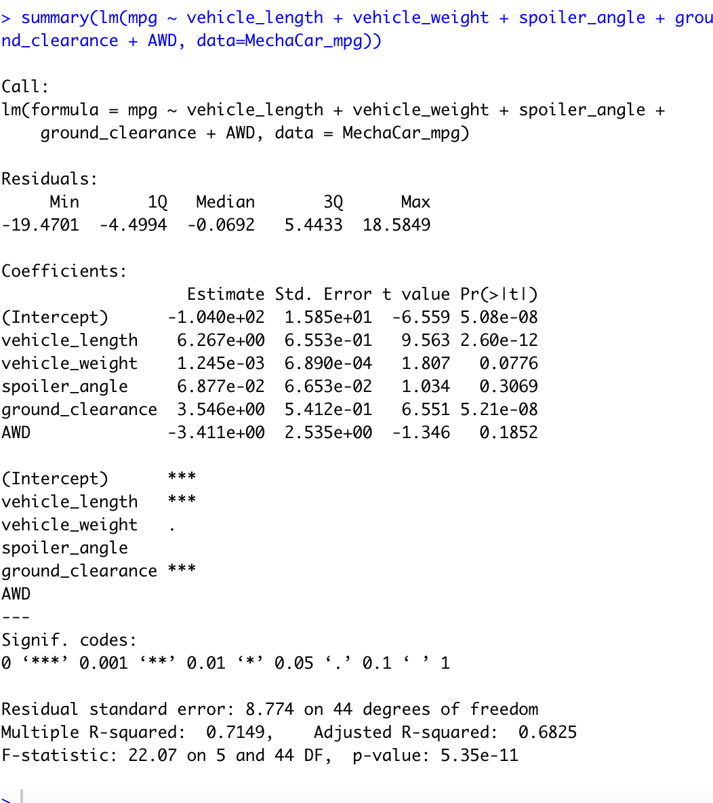
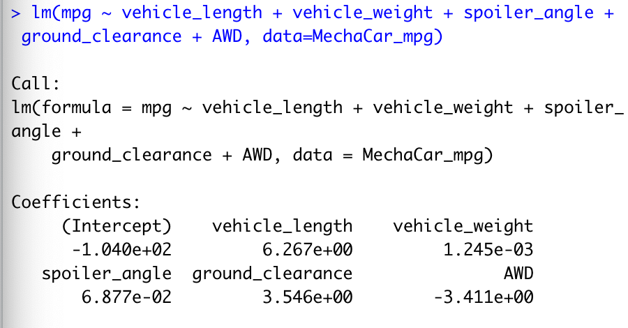
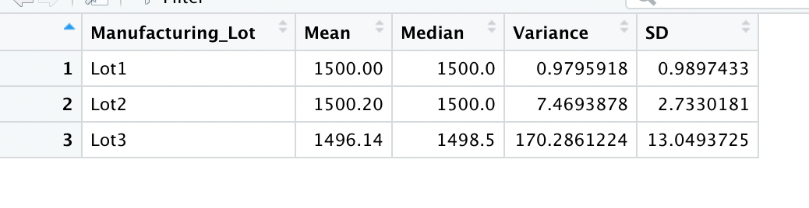
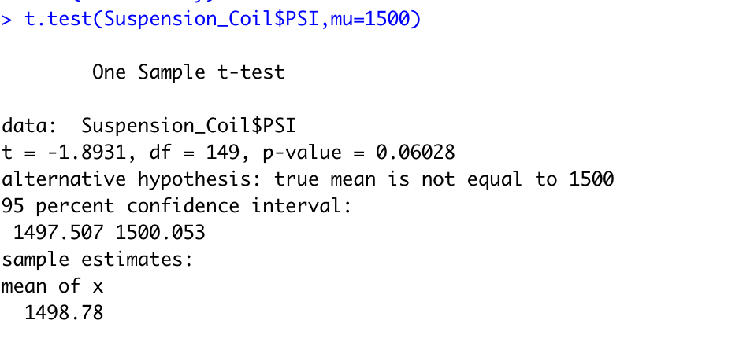
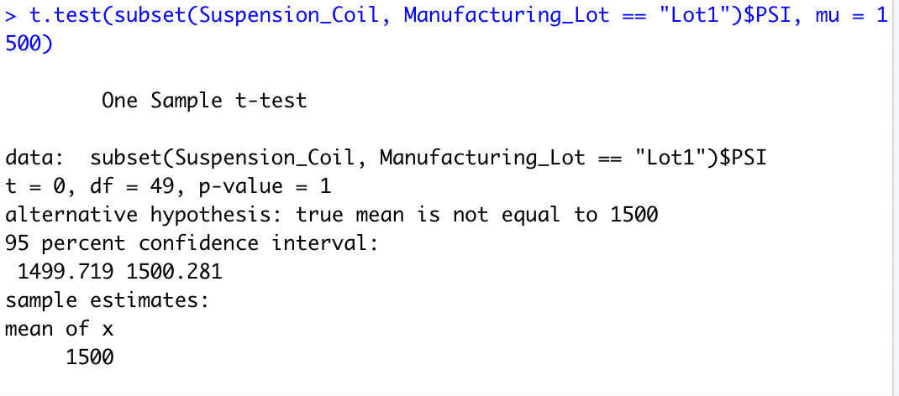
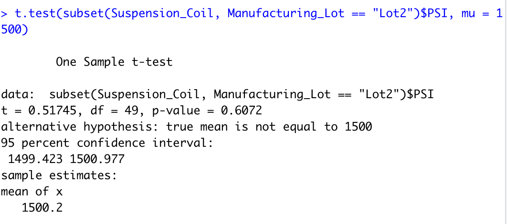
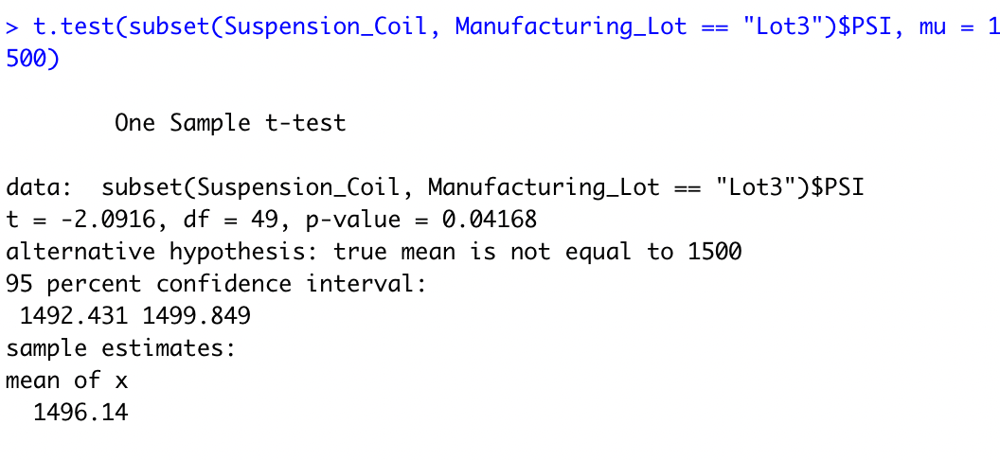

# MechaCar_Statistical_Analysis
## Deliverable 1: Linear Regression to Predict MPG

### Which variables/coefficients provided a non-random amount of variance to the mpg values in the dataset?

The vehicle length, and vehicle ground clearance are statistically likely to provide non-random amounts of variance to the model. Because the p-value is lower than 0.05 or 5%.

### Is the slope of the linear model considered to be zero? Why or why not?

No, beucase p-value for this model is 5.35e-11 which is smaller than 0.05 Therefore, we should reject the null hypothesis of the slope being zero.
### Does this linear model predict mpg of MechaCar prototypes effectively? Why or why not?
Yes,R-squared value is 0.7149, which mean 71% of all mpg predictions will be determined by this model.

## Deliverable 2: Summary Statistics on Suspension Coil
### The design specifications for the MechaCar suspension coils dictate that the variance of the suspension coils must not exceed 100 pounds per square inch. Does the current manufacturing data meet this design specification for all manufacturing lots in total and each lot individually? Why or why not?

the avergae of varinance is 62.29356 whihc seem under 100, but when I see lot#1 and Lot#2 that are lower than 9, but lot#3 is 170.286 which casue the average of three lot is 62.29.
## Deliverable 3: T-Test on Suspension Coils
###  briefly summarize your interpretation and findings for the t-test results. Include screenshots of the t-test to support your summary.

The aboved picture shows a p-value of 0.06028, which is higer than the common significant level 0.05, which mean there is not enough evidence to support rejecting the null hypothesis.

The aboved picture shows a p-value of 1, which is higer than the common significant level 0.05, which mean there is not enough evidence to support rejecting the null hypothesis.

The aboved picture shows a p-value of 0.6072, which is higer than the common significant level 0.05, which mean there is not enough evidence to support rejecting the null hypothesis.

The aboved picture shows a p-value of 0.04168, which is higer than the common significant level 0.05, which mean there is enough evidence to support rejecting the null hypothesis.

## Deliverable 4:Study Design: MechaCar vs Competition.
### Write a short description of a statistical study that can quantify how the MechaCar performs against the competition. In your study design, think critically about what metrics would be of interest to a consumer: for a few examples, cost, city or highway fuel efficiency, horse power, maintenance cost, or safety rating.
There are many factors that consumers take into consideration when evaluating a car to purchase. We will test whether MechaCar is statistically significantly different from competing models on these metrics. The null hypothesis is that these observables are not significantly different from competitors, and the alternative hypothesis is that MechaCar does differ significantly from competitors in these variables.
### What metric or metrics are you going to test?
The price of car
Engine Type
Drive Package 
### What is the null hypothesis or alternative hypothesis?
Null hypothesis
### What statistical test would you use to test the hypothesis? And why?
A multiple linear regression would be used to determine the factors that have the highest correlation for selling price. We can find out what are factors will inflence the price.

### What data is needed to run the statistical test?
Location
The price of car
Engine Type
Drive Package 
